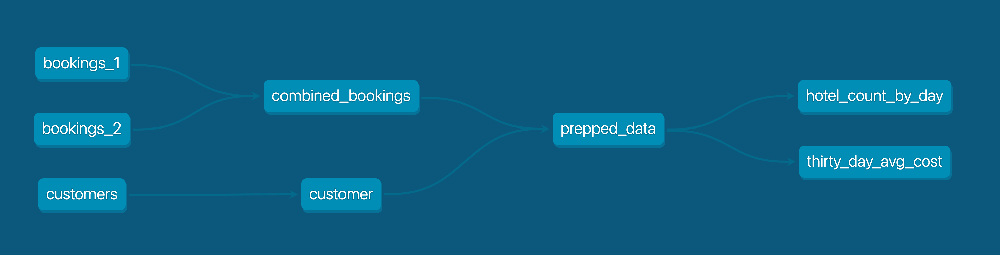
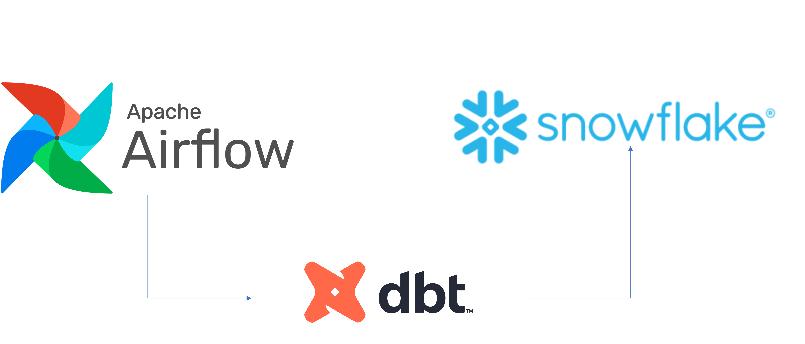

Overview
========
In this virtual hands-on lab, you will follow a step-by-step guide to using Airflow with dbt to create scheduled data transformation jobs. Then, you'll learn how you can make use of this data within Snowpark for further analysis via Python and Pandas transformations.

Let's get started.


- Tutorial: https://quickstarts.snowflake.com/guide/data_engineering_with_apache_airflow/index.html?index=..%2F..index#0


ETL Workflow:
============



Project Contents
================

Your Astro project contains the following files and folders:

- dags: This folder contains the Python files for your Airflow DAGs. By default, this directory includes two example DAGs:
    - `example_dag_basic`: This DAG shows a simple ETL data pipeline example with three TaskFlow API tasks that run daily.
    - `example_dag_advanced`: This advanced DAG showcases a variety of Airflow features like branching, Jinja templates, task groups and several Airflow operators.
- Dockerfile: This file contains a versioned Astro Runtime Docker image that provides a differentiated Airflow experience. If you want to execute other commands or overrides at runtime, specify them here.
- include: This folder contains any additional files that you want to include as part of your project. It is empty by default.
- packages.txt: Install OS-level packages needed for your project by adding them to this file. It is empty by default.
- requirements.txt: Install Python packages needed for your project by adding them to this file. It is empty by default.
- plugins: Add custom or community plugins for your project to this file. It is empty by default.
- airflow_settings.yaml: Use this local-only file to specify Airflow Connections, Variables, and Pools instead of entering them in the Airflow UI as you develop DAGs in this project.




Setup Environment
=================
Go to Snowflake UI and create a new database and warehouse. Then, create a new user and grant the following roles to the user:
```sql
-- Create role dbt_DEV_ROLE
USE ROLE SECURITYADMIN;

CREATE OR REPLACE ROLE dbt_DEV_ROLE COMMENT='dbt_DEV_ROLE';
GRANT ROLE dbt_DEV_ROLE TO ROLE SYSADMIN;

-- Create user dbt_User
CREATE OR REPLACE USER dbt_USER PASSWORD='<PASSWORD>'
	DEFAULT_ROLE=dbt_DEV_ROLE
	DEFAULT_WAREHOUSE=dbt_WH
	COMMENT='dbt User';

GRANT ROLE dbt_DEV_ROLE TO USER dbt_USER;

-- Grant privileges to role
USE ROLE ACCOUNTADMIN;

GRANT CREATE DATABASE ON ACCOUNT TO ROLE dbt_DEV_ROLE;

/*---------------------------------------------------------------------------
Next we will create a virtual warehouse that will be used
---------------------------------------------------------------------------*/
USE ROLE SYSADMIN;

--Create Warehouse for dbt work
CREATE OR REPLACE WAREHOUSE dbt_DEV_WH
  WITH WAREHOUSE_SIZE = 'XSMALL'
  AUTO_SUSPEND = 120
  AUTO_RESUME = true
  INITIALLY_SUSPENDED = TRUE;

GRANT ALL ON WAREHOUSE dbt_DEV_WH TO ROLE dbt_DEV_ROLE;
```


Create database `DEMO_dbt`
```sql
CREATE OR REPLACE DATABASE DEMO_dbt
```


Create tables
```sql
CREATE TABLE bookings_1 (
    id INTEGER,
    booking_reference INTEGER,
    hotel STRING,
    booking_date DATE,
    cost INTEGER
);
CREATE TABLE bookings_2 (
    id INTEGER,
    booking_reference INTEGER,
    hotel STRING,
    booking_date DATE,
    cost INTEGER
);
CREATE TABLE customers (
    id INTEGER,
    first_name STRING,
    last_name STRING,
    birthdate DATE,
    membership_no INTEGER
);
``````


Deploy Your Project Locally
===========================

1. Start Airflow on your local machine by running 'astro dev start'.

This command will spin up 4 Docker containers on your machine, each for a different Airflow component:

- Postgres: Airflow's Metadata Database
- Webserver: The Airflow component responsible for rendering the Airflow UI
- Scheduler: The Airflow component responsible for monitoring and triggering tasks
- Triggerer: The Airflow component responsible for triggering deferred tasks

2. Verify that all 4 Docker containers were created by running 'docker ps'.

Note: Running 'astro dev start' will start your project with the Airflow Webserver exposed at port 8080 and Postgres exposed at port 5432. If you already have either of those ports allocated, you can either [stop your existing Docker containers or change the port](https://docs.astronomer.io/astro/test-and-troubleshoot-locally#ports-are-not-available).

3. Access the Airflow UI for your local Airflow project. To do so, go to http://localhost:8080/ and log in with 'admin' for both your Username and Password.

You should also be able to access your Postgres Database at 'localhost:5432/postgres'.

